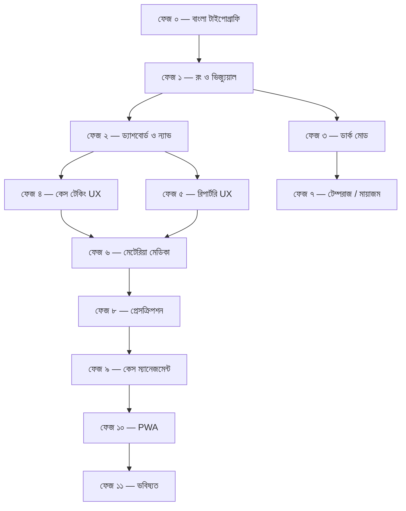

# হোমিও কেস স্টুডিও — UX আপগ্রেড রোডম্যাপ

> **লক্ষ্য:** বাংলা ভাষায় একটি পেশাদার, সুদর্শন ও ব্যবহারবান্ধব হোমিওপ্যাথি ক্লিনিক্যাল অ্যাপ্লিকেশন তৈরি করা — যেখানে বাংলা ফন্ট, রং, আইকন ও ইন্টারফেস সবকিছু বাংলাদেশি ব্যবহারকারীর জন্য সর্বোত্তম হবে।

> **বর্তমান স্ট্যাক:** Vanilla HTML/CSS/JS · Hind Siliguri ফন্ট · Boxicons · localStorage via Shell.bridge · কোনো ব্যাকএন্ড নেই

---

# ফেজ ০ — বাংলা টাইপোগ্রাফি ও পঠনযোগ্যতা (Bangla Typography & Readability)

**অগ্রাধিকার:** ⭐⭐⭐⭐⭐ সবার আগে
**প্রভাব:** সম্পূর্ণ অ্যাপের চেহারা বদলে যাবে
**ঝুঁকি:** কম — শুধু CSS পরিবর্তন

### সমস্যা

বাংলা লেখা ইংরেজির চেয়ে অনেক বেশি জায়গা নেয়। বর্তমানে ফন্ট সাইজ কিছু জায়গায় খুব ছোট — বিশেষত চিপ, ট্যাগ, সাব-টেক্সট ও টেবিল সেলে বাংলা পড়া কঠিন।

### করণীয়

- [x] **বেস ফন্ট সাইজ বাড়ানো** — `body` ফন্ট `16px` থেকে `17px` করা
- [x] **লাইন হাইট বাড়ানো** — বাংলা মাত্রা ও নিচের অংশের জন্য `1.5` থেকে `1.65` করা
- [x] **ন্যূনতম পঠনযোগ্য সাইজ নির্ধারণ** — কোনো বাংলা লেখা `0.75rem` (12px) এর নিচে হবে না
- [x] **ফন্ট ওয়েট ব্যালেন্স** — Hind Siliguri-র `400` ওজন বাংলায় হালকা দেখায়, সাধারণ লেখায় `450` ব্যবহার করা হয়েছে
- [x] **লেটার স্পেসিং সরানো** — `letter-spacing` ও `text-transform: uppercase` বাংলা টেক্সটে সরানো হয়েছে
- [x] **কার্ড ও বাটনে প্যাডিং বাড়ানো** — পেজার, চিপ ও ব্যাজে প্যাডিং বাড়ানো হয়েছে

### ফাইল

| ফাইল | পরিবর্তন |
|-------|----------|
| base.css | বেস ফন্ট সাইজ, লাইন হাইট, বাটন প্যাডিং |
| shell.css | সাইডবার ও টপবারের ফন্ট সাইজ |
| repertory.css | চিপ, ট্যাগ, রুব্রিক তালিকা |
| tempraz.css | ট্রেইট কার্ড, ক্যাটাগরি শিরোনাম |
| miasm.css | রুব্রিক তালিকা, স্কোর ব্যাজ |
| acutes.css | ফ্লো চার্ট নোড, ওষুধ কার্ড |

---

# ফেজ ১ — রং ও ভিজ্যুয়াল পরিচয় (Color & Visual Identity)

**অগ্রাধিকার:** ⭐⭐⭐⭐⭐
**প্রভাব:** অ্যাপটি পেশাদার ও আকর্ষণীয় দেখাবে
**ঝুঁকি:** কম — শুধু CSS কাস্টম প্রপার্টি পরিবর্তন

### সমস্যা

বর্তমান রঙের প্যালেটটি ভালো (teal/emerald) কিন্তু কিছু জায়গায় flat দেখায়। বাংলাদেশি ব্যবহারকারীর কাছে আরো গভীর, উষ্ণ ও পেশাদার রং দরকার।

### করণীয়

- [x] **গ্রেডিয়েন্ট হেডার** — সাইডবার ও টপবারে সূক্ষ্ম গ্রেডিয়েন্ট যোগ করা
- [x] **কার্ড শ্যাডো উন্নত করা** — সূক্ষ্ম একাধিক স্তরের ছায়া
- [x] **অ্যাক্টিভ স্টেট রং** — বর্তমান পেজের সাইডবার আইটেমে বাম দিকে রঙিন বার
- [ ] ~~**মডিউল-ভিত্তিক অ্যাক্সেন্ট রং**~~ *(ব্যবহারকারীর অনুরোধে বাতিল করা হয়েছে - ডিফল্ট রং চোখের জন্য আরামদায়ক)*
- [x] **ডার্ক মোড ভিত্তি** — CSS কাস্টম প্রপার্টি ব্যবহার করে ডার্ক মোডের জন্য প্রস্তুতি (পরে ফেজ ৩-এ চালু করা হবে)
- [x] **হোভার ও ট্রানজিশন উন্নত করা** — বাটন ও কার্ডে মসৃণ অ্যানিমেশন

### ফাইল

| ফাইল | পরিবর্তন |
|-------|----------|
| base.css | `:root` কাস্টম প্রপার্টি, কার্ড শ্যাডো, হোভার |
| shell.css | সাইডবার গ্রেডিয়েন্ট, অ্যাক্টিভ স্টেট |

---

# ফেজ ২ — ড্যাশবোর্ড ও নেভিগেশন (Dashboard & Navigation)

**অগ্রাধিকার:** ⭐⭐⭐⭐
**প্রভাব:** প্রথম পাতা থেকেই পেশাদার অনুভূতি
**ঝুঁকি:** মাঝারি — HTML ও JS পরিবর্তন

### সমস্যা

বর্তমান ড্যাশবোর্ড একটি স্ট্যাটিক কার্ড গ্রিড — কোনো ব্যক্তিগতকরণ বা দ্রুত-প্রবেশ নেই।

### করণীয়

- [x] **সময়-ভিত্তিক অভিবাদন** — "শুভ সন্ধ্যা" / "শুভ সকাল" বাংলায়
- [x] **সম্প্রতি ব্যবহৃত মডিউল** — শেষ ৩টি মডিউল দ্রুত-প্রবেশে দেখানো
- [x] **কার্ডে মাইক্রো-অ্যানিমেশন** — লোডে staggered fade-in, হোভারে সূক্ষ্ম উত্থান
- [x] **মোবাইল বটম ন্যাভিগেশন উন্নত করা** — সবচেয়ে বেশি ব্যবহৃত ৪টি মডিউলের শর্টকাট
- [x] **ব্রেডক্রাম্ব উন্নত করা** — প্রতিটি পেজে কোথায় আছেন তা স্পষ্ট দেখানো
- [x] **সাইডবারে ব্যাজ** — যেমন: রিপার্টরিতে "৩টি রুব্রিক নির্বাচিত"

### ফাইল

| ফাইল | পরিবর্তন |
|-------|----------|
| index.html | হিরো সেকশন, অভিবাদন, সাম্প্রতিক |
| shell.js | সময়-ভিত্তিক অভিবাদন, সাম্প্রতিক মডিউল ট্র্যাকিং |
| shell.css | সাইডবার ব্যাজ, বটম ন্যাভ |

---

# ফেজ ৩ — ডার্ক মোড (Dark Mode)

**অগ্রাধিকার:** ⭐⭐⭐⭐
**প্রভাব:** রাতে ব্যবহার আরামদায়ক, পেশাদার চেহারা
**ঝুঁকি:** মাঝারি — সব CSS ফাইলে `[data-theme="dark"]` যোগ করতে হবে

### সমস্যা

রাতের বেলা সাদা পটভূমিতে বাংলা পড়তে চোখে কষ্ট হয়। হোমিওপ্যাথিক প্র্যাক্টিশনাররা প্রায়ই সন্ধ্যায় কেস পর্যালোচনা করেন।

### করণীয়

- [ ] **ডার্ক মোড টগল** — সাইডবারে বা টপবারে চাঁদ/সূর্য আইকন দিয়ে সুইচ
- [ ] **সিস্টেম প্রেফারেন্স** — `prefers-color-scheme: dark` সমর্থন
- [ ] **ডার্ক কালার প্যালেট** — গাঢ় স্লেট পটভূমি, নরম সবুজ অ্যাক্সেন্ট
- [ ] **ডার্ক মোডে বাংলা পঠনযোগ্যতা** — হালকা ধূসর টেক্সট, বাড়তি কন্ট্রাস্ট
- [ ] **ব্যবহারকারীর পছন্দ মনে রাখা** — localStorage-এ সংরক্ষণ

### ফাইল

| ফাইল | পরিবর্তন |
|-------|----------|
| base.css | `[data-theme="dark"]` কাস্টম প্রপার্টি |
| সব CSS ফাইল | ডার্ক মোডে রং সামঞ্জস্য |
| shell.js | টগল লজিক ও সংরক্ষণ |

---

# ফেজ ৪ — কেস টেকিং UX উন্নতি (Case Taking UX)

**অগ্রাধিকার:** ⭐⭐⭐⭐
**প্রভাব:** সবচেয়ে বেশি ব্যবহৃত মডিউলের অভিজ্ঞতা উন্নত
**ঝুঁকি:** মাঝারি

### সমস্যা

কেস ফর্মটি ৯ ধাপের — দীর্ঘ ফর্ম পূরণ করতে গিয়ে ব্যবহারকারী ক্লান্ত হতে পারেন। এছাড়া প্রতিটি ধাপে কতটুকু পূরণ হয়েছে তা বোঝা যায় না।

### করণীয়

- [ ] **ধাপ-ভিত্তিক সম্পূর্ণতার সূচক** — প্রতিটি ধাপের পাশে সবুজ টিক বা অগ্রগতি বার
- [ ] **ইনলাইন ভ্যালিডেশন** — ফিল্ড ছেড়ে যাওয়ার সাথে সাথে ত্রুটি দেখানো, লাল নয় বরং সৌম্য কমলা
- [ ] **স্মার্ট ডিফল্ট** — বাংলাদেশের জন্য সাধারণ মান প্রি-ফিল্ড (যেমন: দেশ = বাংলাদেশ)
- [ ] **অটোসেভ ইন্ডিকেটর** — "সংরক্ষিত ✓" বাজ সহ শেষ সংরক্ষণের সময়
- [ ] **কুইক-অ্যাড চিপ** — সাধারণ লক্ষণগুলো (মাথা ব্যথা, জ্বর, কাশি) চিপ আকারে — ট্যাপ করলেই যোগ হবে
- [ ] **ইনপুটে প্লেসহোল্ডার উদাহরণ** — প্রতিটি ফিল্ডে বাংলায় সহায়ক উদাহরণ

### ফাইল

| ফাইল | পরিবর্তন |
|-------|----------|
| case.html | ধাপ সূচক, কুইক-অ্যাড চিপ |
| case-form.js | অটোসেভ, ভ্যালিডেশন, স্মার্ট ডিফল্ট |
| base.css | ফর্ম ফিল্ড স্টাইল |

---

# ফেজ ৫ — রিপার্টরি UX উন্নতি (Repertory UX)

**অগ্রাধিকার:** ⭐⭐⭐⭐⭐
**প্রভাব:** মূল ক্লিনিক্যাল টুলের দক্ষতা বৃদ্ধি
**ঝুঁকি:** মাঝারি-উচ্চ

### সমস্যা

রুব্রিক খোঁজা ও বাছাই করা বর্তমানে ধীর হতে পারে, বিশেষত ৬৬,০০০+ রুব্রিকের কেন্ট রিপার্টরিতে। বাংলা ও ইংরেজি মিশ্রিত সার্চ দরকার।

### করণীয়

- [ ] **ফাজি সার্চ** — বানান ভুল থাকলেও ফলাফল দেখানো ("হেডেক" → "Headache")
- [ ] **দ্বিভাষিক সার্চ** — বাংলায় "মাথা ব্যথা" লিখলে "Head, Pain" রুব্রিক দেখানো
- [ ] **সাম্প্রতিক রুব্রিক** — শেষ ২০টি ব্যবহৃত রুব্রিক দ্রুত-প্রবেশে
- [ ] **রুব্রিক প্রিভিউ** — রুব্রিকে হোভার করলে ওষুধের সংক্ষিপ্ত তালিকা দেখানো (tooltip)
- [ ] **ড্র্যাগ-টু-রিঅর্ডার** — কেসের রুব্রিক তালিকায় গুরুত্বের ক্রমে সাজানো
- [ ] **রুব্রিক গ্রুপিং** — একই অধ্যায়ের রুব্রিক একসাথে দেখানো
- [ ] **রেপার্টরাইজেশন গ্রিডে রঙিন হিটম্যাপ** — গ্রেড ১/২/৩ আরো স্পষ্ট রঙে

### ফাইল

| ফাইল | পরিবর্তন |
|-------|----------|
| repertory.js | ফাজি সার্চ, সাম্প্রতিক রুব্রিক, প্রিভিউ |
| repertory.css | হিটম্যাপ রং, প্রিভিউ টুলটিপ |

---

# ফেজ ৬ — মেটেরিয়া মেডিকা ও ওষুধ প্রোফাইল (Materia Medica & Remedy UX)

**অগ্রাধিকার:** ⭐⭐⭐⭐
**প্রভাব:** ওষুধ নির্বাচনের নিশ্চয়তা বৃদ্ধি
**ঝুঁকি:** মাঝারি

### করণীয়

- [ ] **ওষুধ প্রোফাইল কার্ড** — প্রতিটি ওষুধের জন্য সুন্দর কার্ড (বাংলা নাম, ইংরেজি নাম, কীনোট, মোডালিটি)
- [ ] **তুলনা ভিউ উন্নত** — পাশাপাশি ২-৩টি ওষুধ তুলনা, পার্থক্য হাইলাইট করা
- [ ] **ওষুধের সম্পর্ক দেখানো** — তীরচিহ্ন দিয়ে কমপ্লিমেন্টারি, ইনিমিক্যাল ওষুধ
- [ ] **লক্ষণ দিয়ে ওষুধ খোঁজা** — "ডান দিকের মাথা ব্যথা" → প্রাসঙ্গিক ওষুধ
- [ ] **ওষুধের ছবি/আইকন** — প্রতিটি ওষুধের উৎসের ছবি (উদ্ভিদ, খনিজ, প্রাণিজ)

### ফাইল

| ফাইল | পরিবর্তন |
|-------|----------|
| materia.js | তুলনা ভিউ, সম্পর্ক |
| materia.css | প্রোফাইল কার্ড, তুলনা লেআউট |

---

# ফেজ ৭ — বিশেষ বিশ্লেষণ টুল UX (Tempraz, Miasm, Acutes)

**অগ্রাধিকার:** ⭐⭐⭐
**প্রভাব:** বিশেষায়িত বিশ্লেষণের মান বৃদ্ধি
**ঝুঁকি:** কম-মাঝারি

### টেম্পরাজ

- [ ] **ট্রেইট কার্ডে ইমোজি/আইকন** — প্রতিটি বৈশিষ্ট্যের পাশে প্রাসঙ্গিক আইকন
- [ ] **ফলাফল চার্ট** — পাই/রাডার চার্টে স্বভাবের অনুপাত দেখানো
- [ ] **ব্যক্তিত্বের সংক্ষিপ্ত বিবরণ** — ফলাফলের পর ২-৩ লাইনে বাংলায় ব্যক্তিত্বের বর্ণনা

### মায়াজম

- [ ] **মায়াজম স্কোরের ভিজ্যুয়াল বার** — সংখ্যার বদলে রঙিন বার দিয়ে স্কোর
- [ ] **মায়াজম ব্যাখ্যা** — প্রতিটি মায়াজমের অর্থ ও প্রভাব বাংলায়

### অ্যাকিউট

- [ ] **ফ্লো চার্ট অ্যানিমেশন** — ধাপে ধাপে এগোনোর সময় মসৃণ ট্রানজিশন
- [ ] **ওষুধ কার্ডে বিস্তারিত** — প্রতিটি ওষুধের কীনোট ট্যাপেই দেখা যাবে

---

# ফেজ ৮ — প্রেসক্রিপশন ও প্রিন্ট (Prescription & Print)

**অগ্রাধিকার:** ⭐⭐⭐⭐
**প্রভাব:** চূড়ান্ত আউটপুটের মান
**ঝুঁকি:** কম

### করণীয়

- [ ] **প্রেসক্রিপশন টেমপ্লেট** — ২-৩টি ভিন্ন ডিজাইনের টেমপ্লেট (ক্লাসিক, মডার্ন, মিনিমাল)
- [ ] **লেটারহেড কাস্টমাইজেশন** — চিকিৎসকের নাম, ডিগ্রি, ক্লিনিকের ঠিকানা, লোগো
- [ ] **প্রিন্ট প্রিভিউ** — প্রিন্ট করার আগে কেমন দেখাবে সেটি দেখানো
- [ ] **PDF এক্সপোর্ট** — সরাসরি PDF ডাউনলোড
- [ ] **ফলোআপ তারিখ** — পরবর্তী ভিজিটের তারিখ ও নোট

---

# ফেজ ৯ — কেস ম্যানেজমেন্ট ও স্টোরেজ (Case Management)

**অগ্রাধিকার:** ⭐⭐⭐⭐⭐
**প্রভাব:** অ্যাপটিকে শুধু টুল থেকে ওয়ার্কস্পেসে রূপান্তর
**ঝুঁকি:** উচ্চ — আর্কিটেকচারাল পরিবর্তন

### করণীয়

- [ ] **স্থায়ী কেস আইডি** — প্রতিটি কেসের একটি ইউনিক আইডি (CASE-2026-0001)
- [ ] **একক কেস অবজেক্ট** — সব মডিউলের ডেটা এক জায়গায়
- [ ] **কেস তালিকা পেজ** — সব কেস দেখা, খোঁজা, ফিল্টার করা
- [ ] **কেস ওয়ার্কস্পেস** — একটি কেসের সব বিশ্লেষণ এক জায়গায়
- [ ] **স্টোরেজ অ্যাবস্ট্রাকশন** — `Shell.storage.saveCase()` ধরনের API
- [ ] **ব্যাকআপ ও রিস্টোর** — JSON ফাইলে সব ডেটা এক্সপোর্ট ও ইম্পোর্ট

### নতুন ফাইল

```
cases.html          → কেস তালিকা
case-workspace.html → কেস ওয়ার্কস্পেস
```

### তথ্য কাঠামো

```javascript
{
    case_id: "CASE-2026-0001",
    patient: { name: "", age: null, gender: "" },
    case_data: { /* কেস ফর্মের তথ্য */ },
    tempraz: { /* টেম্পরাজ বিশ্লেষণ */ },
    miasm: { /* মায়াজম বিশ্লেষণ */ },
    repertory: { /* রুব্রিক ও ফলাফল */ },
    prescription: { /* ওষুধ ও মাত্রা */ },
    followups: [],
    created_at: "",
    updated_at: ""
}
```

---

# ফেজ ১০ — PWA ও অফলাইন (Progressive Web App)

**অগ্রাধিকার:** ⭐⭐⭐
**প্রভাব:** মোবাইলে ইনস্টল ও অফলাইন ব্যবহার
**ঝুঁকি:** কম

### করণীয়

- [ ] **manifest.json** — অ্যাপের নাম, আইকন, রং
- [ ] **সার্ভিস ওয়ার্কার** — স্ট্যাটিক ফাইল ক্যাশ
- [ ] **অফলাইন পেজ** — ইন্টারনেট না থাকলে সুন্দর বার্তা
- [ ] **ইনস্টল প্রম্পট** — "হোম স্ক্রিনে যোগ করুন" বাংলায়

---

# ফেজ ১১ — ভবিষ্যত (Future Enhancements)

**অগ্রাধিকার:** পরে
**ঝুঁকি:** উচ্চ — বড় আর্কিটেকচারাল পরিবর্তন

### সম্ভাব্য ফিচার

- [ ] রোগীর টাইমলাইন (একাধিক ভিজিট)
- [ ] ফলোআপ ও আউটকাম ট্র্যাকিং
- [ ] সদৃশ কেস খোঁজা
- [ ] AI-সহায়তা (লক্ষণ থেকে রুব্রিক সাজেশন)
- [ ] ক্লাউড সিঙ্ক (Laravel API)
- [ ] মাল্টি-ডিভাইস সিঙ্ক

---

# কার্যক্রমের ক্রম



---

# সারসংক্ষেপ

| ফেজ | বিষয় | অগ্রাধিকার | ঝুঁকি | প্রভাব |
|------|-------|-----------|-------|--------|
| ০ | বাংলা টাইপোগ্রাফি | ⭐⭐⭐⭐⭐ | কম | সর্বোচ্চ |
| ১ | রং ও ভিজ্যুয়াল | ⭐⭐⭐⭐⭐ | কম | উচ্চ |
| ২ | ড্যাশবোর্ড ও ন্যাভ | ⭐⭐⭐⭐ | মাঝারি | উচ্চ |
| ৩ | ডার্ক মোড | ⭐⭐⭐⭐ | মাঝারি | উচ্চ |
| ৪ | কেস টেকিং UX | ⭐⭐⭐⭐ | মাঝারি | উচ্চ |
| ৫ | রিপার্টরি UX | ⭐⭐⭐⭐⭐ | মাঝারি-উচ্চ | সর্বোচ্চ |
| ৬ | মেটেরিয়া মেডিকা | ⭐⭐⭐⭐ | মাঝারি | উচ্চ |
| ৭ | টেম্পরাজ / মায়াজম | ⭐⭐⭐ | কম-মাঝারি | মাঝারি |
| ৮ | প্রেসক্রিপশন | ⭐⭐⭐⭐ | কম | উচ্চ |
| ৯ | কেস ম্যানেজমেন্ট | ⭐⭐⭐⭐⭐ | উচ্চ | সর্বোচ্চ |
| ১০ | PWA | ⭐⭐⭐ | কম | মাঝারি |
| ১১ | ভবিষ্যত | পরে | উচ্চ | সর্বোচ্চ |

---

> **মূলনীতি:** প্রতিটি ফেজ এককভাবে সম্পন্ন করা যাবে — কোনো ফেজ অসম্পূর্ণ রেখে পরের ফেজে যাওয়ার দরকার নেই। প্রতিটি ফেজের পর অ্যাপটি আগের চেয়ে ভালো দেখাবে ও কাজ করবে।
